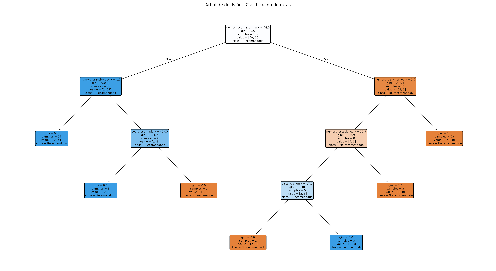
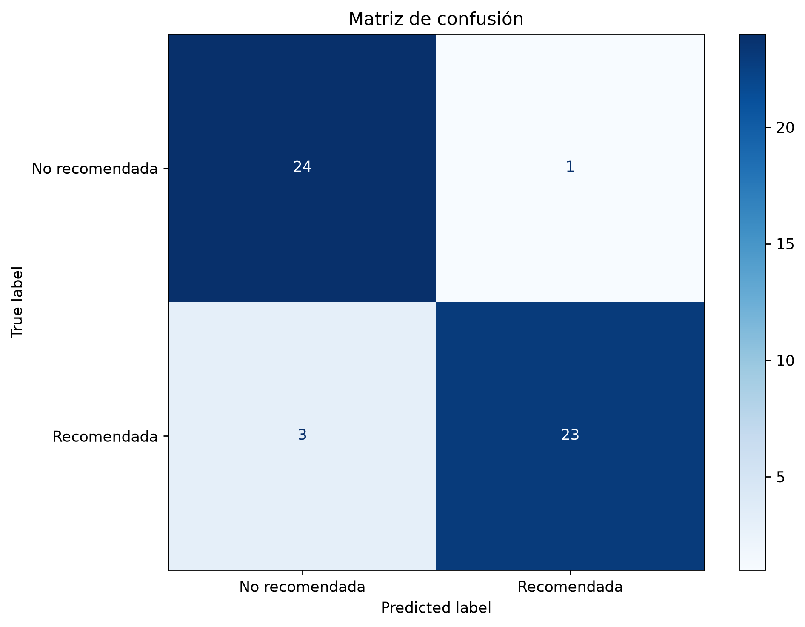
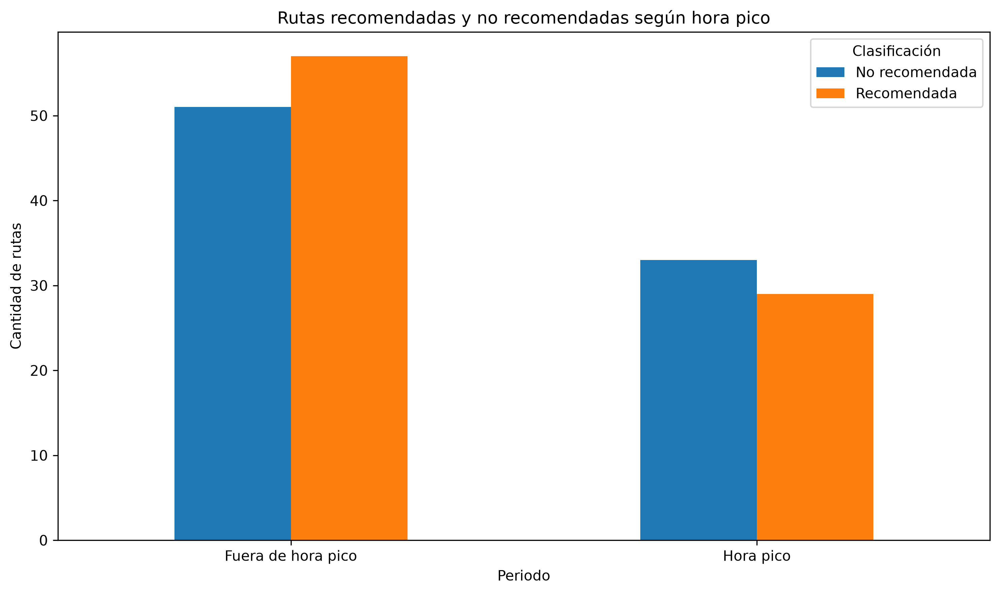
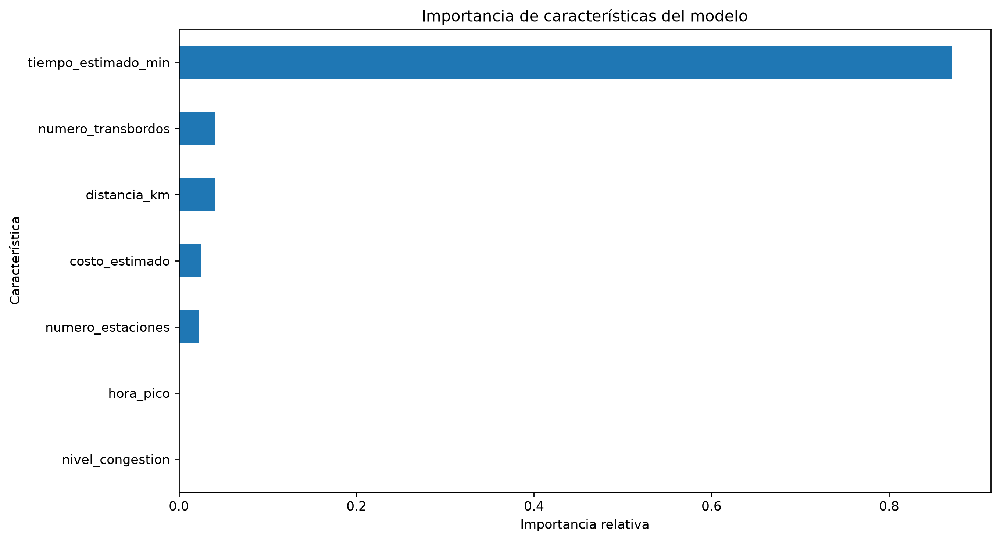

# Sistema Inteligente de Búsqueda y Clasificación de Rutas

Proyecto académico desarrollado para la asignatura de
**Inteligencia Artificial** de la Corporación Universitaria
Iberoamericana.

El sistema integra dos enfoques de inteligencia artificial:

1. Representación del conocimiento, reglas lógicas y búsqueda
   heurística mediante el algoritmo A*.
2. Aprendizaje supervisado mediante un árbol de decisión
   para clasificar rutas como recomendadas o no recomendadas.

> **Nota:** Las estaciones toman como referencia nombres del
> sistema de transporte de Bogotá, pero las conexiones,
> coordenadas, costos y datos utilizados corresponden a
> modelos académicos simplificados. No representan
> información operacional real de TransMilenio.

---

## 1. Objetivo general

Desarrollar un sistema inteligente capaz de encontrar rutas
entre estaciones de transporte y analizar sus características
mediante técnicas de búsqueda heurística y aprendizaje
supervisado.

### Objetivos específicos

- Representar estaciones y conexiones mediante un grafo.
- Aplicar reglas lógicas para validar las consultas.
- Implementar A* para buscar rutas de menor costo.
- Construir un dataset académico de rutas de transporte.
- Entrenar un modelo supervisado de clasificación.
- Evaluar el modelo mediante métricas y gráficas.
- Implementar pruebas automáticas del sistema.

---

## 2. Primera etapa: búsqueda inteligente con A*

### 2.1. Base de conocimiento

La base de conocimiento se encuentra en `conocimiento.py`.

El sistema de transporte se representa mediante un grafo:

- Los nodos representan estaciones.
- Las aristas representan conexiones.
- Los valores asociados representan el costo del desplazamiento.
- Las coordenadas permiten calcular la heurística.

### 2.2. Reglas lógicas

El archivo `reglas.py` contiene reglas para:

- Validar la existencia de una estación.
- Determinar si origen y destino son iguales.
- Verificar conexiones directas.
- Obtener las conexiones disponibles.

### 2.3. Búsqueda heurística

El archivo `busqueda.py` implementa el algoritmo A*.

A* utiliza la función:

```text
f(n) = g(n) + h(n)
```

Donde:

- `g(n)` representa el costo acumulado desde el origen.
- `h(n)` representa la estimación del costo restante.
- `f(n)` representa el costo total estimado.

La heurística se calcula mediante distancia euclidiana
entre las coordenadas simplificadas de las estaciones.

### 2.4. Ejecución del sistema A*

Desde la raíz del proyecto:

```bash
py main.py
```

El programa permite consultar estaciones y encontrar
rutas entre un origen y un destino.

### 2.5. Resultados de la primera etapa

Se documentaron los siguientes casos:

| Ruta | Resultado |
|---|---|
| Portal Sur → Portal Norte | Costo 37 |
| Portal Suba → Portal Américas | Costo 39 |

Se desarrollaron siete pruebas automáticas del sistema A*,
todas aprobadas.

La documentación detallada está disponible en:

`docs/Pruebas_Sistema_Inteligente.pdf`

---

## 3. Segunda etapa: aprendizaje supervisado

### 3.1. Descripción

Se incorporó un modelo de aprendizaje supervisado para
clasificar rutas de transporte según sus características.

El algoritmo seleccionado es un árbol de decisión,
implementado con la biblioteca scikit-learn.

El modelo realiza una clasificación binaria:

- `0`: Ruta no recomendada.
- `1`: Ruta recomendada.

La clasificación se basa en un dataset académico sintético.

### 3.2. Dataset

El archivo principal es:

`datos/rutas_transporte.csv`

Contiene 170 registros:

- 20 registros originales.
- 150 registros sintéticos adicionales.

El archivo `datos/rutas_base.csv` conserva los registros
originales.

El script `datos/generar_dataset.py` permite reconstruir
el conjunto completo de forma reproducible utilizando
una semilla fija de 42.

### 3.3. Variables del dataset

| Variable | Descripción |
|---|---|
| distancia_km | Distancia simulada en kilómetros |
| numero_estaciones | Cantidad de estaciones |
| numero_transbordos | Cantidad de transbordos |
| nivel_congestion | Congestión simulada de 1 a 5 |
| tiempo_estimado_min | Tiempo estimado en minutos |
| costo_estimado | Costo en unidades académicas |
| hora | Hora simulada del recorrido |
| hora_pico | 1 si es hora pico; 0 en caso contrario |
| ruta_recomendada | Etiqueta objetivo: 0 o 1 |

La columna `hora` se utiliza para determinar `hora_pico`,
pero no se introduce directamente al árbol de decisión.

El modelo utiliza siete variables predictoras.

### 3.4. Generación de etiquetas

Las etiquetas de los nuevos registros se generan
mediante una regla académica que combina:

- Tiempo estimado.
- Costo estimado.
- Número de transbordos.
- Nivel de congestión.
- Hora pico.

Un menor puntaje favorece la clasificación de una ruta
como recomendada.

Se introduce una pequeña variación aleatoria para
evitar que todas las etiquetas sigan una regla rígida.

Estas etiquetas son sintéticas y no corresponden a
decisiones reales de usuarios.

### 3.5. Entrenamiento del modelo

Se utiliza `DecisionTreeClassifier` con:

- Profundidad máxima: 4.
- Semilla aleatoria: 42.
- Entrenamiento: 70 %.
- Prueba: 30 %.
- División estratificada por clase.

Para los 170 registros:

- Entrenamiento: 119 registros.
- Prueba: 51 registros.

### 3.6. Resultados obtenidos

En la ejecución realizada se obtuvo:

**Exactitud del modelo: 92,16 %.**

Matriz de confusión:

```text
[[24  1]
 [ 3 23]]
```

De las 51 observaciones de prueba:

- 47 fueron clasificadas correctamente.
- 4 fueron clasificadas incorrectamente.

Resultados por clase:

| Métrica | No recomendada | Recomendada |
|---|---:|---:|
| Precision | 0.89 | 0.96 |
| Recall | 0.96 | 0.88 |
| F1-score | 0.92 | 0.92 |

Estos resultados corresponden al conjunto sintético
utilizado en el proyecto.

### 3.7. Importancia de características

El modelo evaluado presentó las siguientes importancias:

| Característica | Importancia |
|---|---:|
| Tiempo estimado | 87,11 % |
| Número de transbordos | 4,07 % |
| Distancia | 4,03 % |
| Costo estimado | 2,52 % |
| Número de estaciones | 2,27 % |
| Hora pico | 0 % |
| Nivel de congestión | 0 % |

El tiempo estimado fue la característica más influyente
en este árbol de decisión.

Una importancia de cero indica que el árbol entrenado
no utilizó directamente esa característica en sus
divisiones. No demuestra que la variable carezca
de relevancia en el transporte real.

### 3.8. Visualizaciones

El entrenamiento genera cuatro gráficas:

- `graficas/arbol_decision.png`
- `graficas/matriz_confusion.png`
- `graficas/rutas_hora_pico.png`
- `graficas/importancia_caracteristicas.png`

#### Árbol de decisión



#### Matriz de confusión



#### Clasificación según hora pico



#### Importancia de características



---

## 4. Estructura del proyecto

```text
SistemaInteligente/
|
|-- main.py
|-- conocimiento.py
|-- reglas.py
|-- busqueda.py
|-- README.md
|-- requirements.txt
|-- .gitignore
|
|-- datos/
|   |-- rutas_base.csv
|   |-- rutas_transporte.csv
|   |-- generar_dataset.py
|
|-- ml/
|   |-- __init__.py
|   |-- configuracion.py
|   |-- entrenar_modelo.py
|   |-- predecir_ruta.py
|
|-- modelos/
|   |-- modelo_rutas.joblib
|
|-- graficas/
|   |-- arbol_decision.png
|   |-- matriz_confusion.png
|   |-- rutas_hora_pico.png
|   |-- importancia_caracteristicas.png
|
|-- tests/
|   |-- test_sistema.py
|   |-- test_modelo.py
|
|-- docs/
|   |-- Pruebas_Sistema_Inteligente.pdf
|   |-- Descripcion_Datos.pdf
|   |-- Pruebas_Modelo_Supervisado.pdf
```

**Nota:** `modelo_rutas.joblib` se genera localmente al
entrenar y no necesita almacenarse en GitHub.
Los dos documentos nuevos de `docs/` se incorporarán
al finalizar la documentación.

---

## 5. Requisitos

- Python 3.
- pandas.
- scikit-learn.
- matplotlib.
- joblib.

Instalar dependencias:

```bash
py -m pip install -r requirements.txt
```

---

## 6. Ejecución del proyecto

Todos los comandos deben ejecutarse desde la raíz
del repositorio.

### 6.1. Ejecutar búsqueda A*

```bash
py main.py
```

### 6.2. Generar dataset

```bash
py datos/generar_dataset.py
```

Resultado esperado:

```text
Registros originales: 20
Registros nuevos: 150
Total de registros: 170
Columnas: 9
```

### 6.3. Entrenar modelo supervisado

```bash
py -m ml.entrenar_modelo
```

Este comando:

1. Carga y valida los datos.
2. Divide los datos en entrenamiento y prueba.
3. Entrena un árbol de decisión.
4. Evalúa las predicciones.
5. Genera las gráficas.
6. Entrena el modelo final con todos los registros.
7. Guarda el modelo en `modelos/`.

### 6.4. Realizar una predicción

```bash
py -m ml.predecir_ruta
```

El script carga el modelo previamente guardado
y clasifica una nueva ruta.

En la ejecución documentada, la ruta de ejemplo
obtuvo:

```text
Resultado: RUTA RECOMENDADA
```

Para cambiar los valores de la ruta se puede editar
el diccionario `nueva_ruta` de `ml/predecir_ruta.py`.

---

## 7. Pruebas automáticas

Las pruebas se implementaron con `unittest`.

Ejecutar:

```bash
py -m unittest discover -s tests -v
```

Se incluyen:

- 7 pruebas del sistema original A*.
- 8 pruebas del componente supervisado.

**Resultado registrado: 15 pruebas aprobadas.**

Las pruebas comprueban la validez de los datos,
el entrenamiento y la clasificación, además del
funcionamiento del sistema original.

---

## 8. Documentación y evidencias

La carpeta `docs/` reúne las evidencias académicas
de las diferentes etapas.

### Sistema A*

`Pruebas_Sistema_Inteligente.pdf`

Incluye pruebas funcionales, capturas, resultados
y conclusiones de la búsqueda heurística.

### Aprendizaje supervisado

`Descripcion_Datos.pdf`

Describe el origen académico de los datos,
sus variables y el proceso de generación.

`Pruebas_Modelo_Supervisado.pdf`

Documenta el entrenamiento, la evaluación,
las gráficas, las predicciones y las pruebas.

---

## 9. Limitaciones

Este proyecto tiene fines exclusivamente académicos.

- El grafo A* representa una red simplificada.
- El dataset es sintético.
- Las etiquetas se generan mediante reglas simuladas.
- Los costos no equivalen a tarifas reales.
- Los horarios pico son supuestos académicos.
- El modelo no consulta tráfico en tiempo real.
- La exactitud obtenida no demuestra rendimiento
  en escenarios reales de transporte.
- La búsqueda A* y el clasificador supervisado
  son componentes independientes.

Para un uso real sería necesario incorporar
datos operacionales, etiquetas verificadas,
validación adicional e integración con el sistema
de rutas.

---

## 10. Conclusiones

El proyecto demuestra dos aplicaciones de la
inteligencia artificial en un contexto de transporte.

La primera etapa implementa representación del
conocimiento, reglas lógicas y búsqueda heurística
A* para encontrar rutas en un grafo.

La segunda incorpora aprendizaje supervisado
mediante un árbol de decisión, utilizando datos
sintéticos para clasificar rutas.

El modelo obtuvo una exactitud de 92,16 % en el
conjunto de prueba y las 15 pruebas automatizadas
finalizaron satisfactoriamente.

Los resultados respaldan el funcionamiento del
prototipo académico dentro de las condiciones
y limitaciones establecidas.
## Aprendizaje no supervisado: agrupamiento de rutas con K-Means

### Objetivo

Aplicar aprendizaje no supervisado para agrupar rutas con características similares, sin utilizar la variable `ruta_recomendada` como objetivo de entrenamiento.

### Variables utilizadas

El algoritmo utiliza las siguientes siete variables:

- `distancia_km`: distancia de la ruta.
- `numero_estaciones`: número de estaciones.
- `numero_transbordos`: número de transbordos.
- `nivel_congestion`: nivel de congestión.
- `tiempo_estimado_min`: tiempo estimado.
- `costo_estimado`: coste estimado.
- `hora_pico`: indicador de hora punta.

### Metodología

1. Cargar los datos del conjunto de rutas.
2. Comprobar que existen las columnas necesarias y que no hay valores nulos.
3. Estandarizar las variables mediante `StandardScaler`.
4. Evaluar distintos valores de K, desde 2 hasta 6.
5. Analizar la inercia mediante el método del codo y la puntuación de silueta.
6. Aplicar K-Means con `K=2` y `random_state=42`.
7. Representar los grupos en dos dimensiones mediante PCA.
8. Guardar las etiquetas de agrupamiento en `datos/rutas_agrupadas.csv`.

### Resultados

La configuración seleccionada utiliza dos clusters. En las pruebas realizadas, K=2 obtuvo una puntuación de silueta de aproximadamente 0,4054.

Los grupos se diferencian principalmente por la distancia, el número de estaciones, los transbordos, el tiempo estimado y el coste. Estos resultados permiten explorar patrones en los datos, pero no representan categorías oficiales del transporte real.

### Ejecución

Para ejecutar el agrupamiento:

```bash
python ml/agrupar_rutas.py
```

### Pruebas

Para ejecutar las pruebas específicas del aprendizaje no supervisado:

```bash
python -m pytest tests/test_agrupamiento.py -v
```

Las ocho pruebas implementadas finalizaron correctamente en la última ejecución.

### Documentación adicional

- `docs/descripcion_aprendizaje_no_supervisado.pdf`: descripción de la metodología y del algoritmo.
- `docs/pruebas_aprendizaje_no_supervisado.pdf`: descripción de las pruebas realizadas.